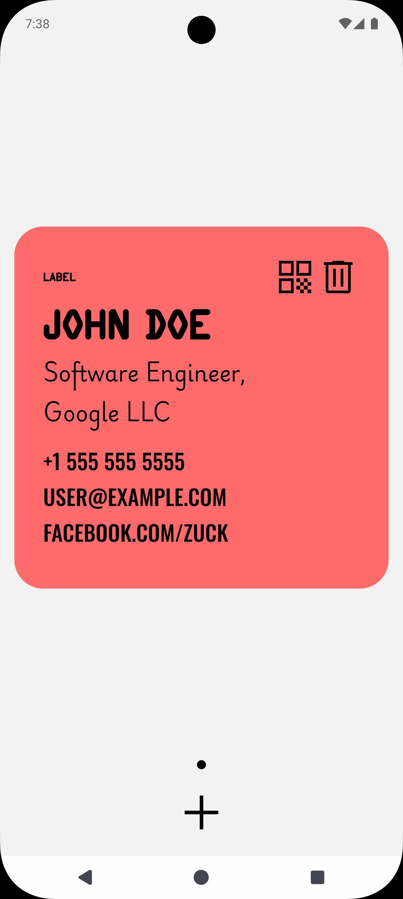
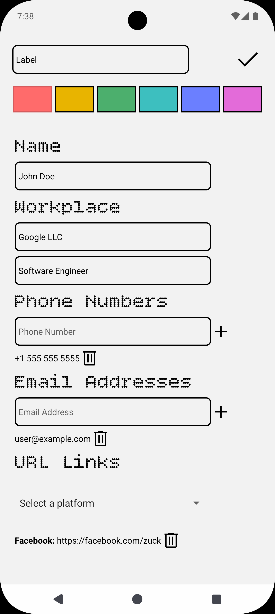
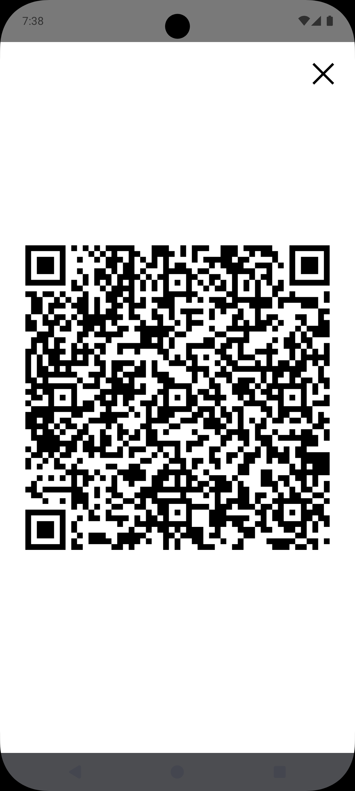

# QR You

QR You is a mobile app designed to share contact details using QR codes.

You can share your name, phone numbers, email addresses, links, and a place of work on a single card.
You can create multiple cards to be used for different purposes. (work, personal, etc.)

The project is currently in Pre-Alpha.

## Screenshots

<!-- markdownlint-disable-file MD033 -->

